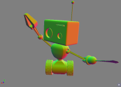
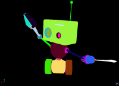
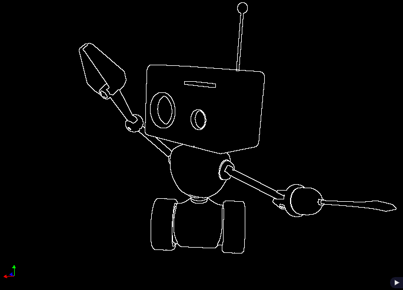
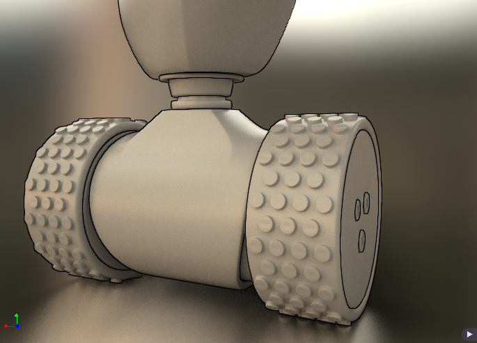
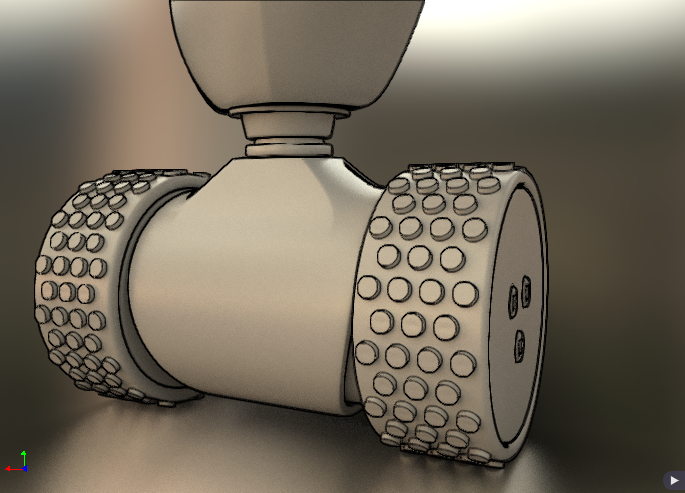

# Silhouette and toon shading

This sample is loading a glTF scene and extracting lines for object contours and details, like when there is a sharp curvature on the object.

This is only post-processing, no line/edge drawing.

## Line extractions

Either we are using the raster or the ray tracer, the renderer must provide 3 data information: normal, depth, object id. 

In the fragment shader, or in the closest hit shader, these data will be stored in a single RGBA32F buffer, where the first XY will have the normal data encoded, Z, the depth and W the object ID, an integer we cast to float.

## Contour Extraction

To extract the contour, we are using a post-processing pipeline, mainly using a fragment shader. There is a case where we are using a compute shader to find the min and max value of the depth buffer.

The extraction of the object contour is done by comparing the actual pixel with the neighbors. We compare each immediate neighbor if the value is greather, smaller or different from the current one. This has for effect to create a line on the current object, outside of it or both, which makes a thicker line.

~~~~
     +---+---+---+
     | A | B | C |
     +---+---+---+
     | D | X | E |
     +---+---+---+
     | F | G | H |
     +---+---+---+
~~~~

Comparing X against any A-H, if one value is (< , >, !=) then we set 1 to the result.

The GLSL shader is a fragment shader, but to use the `unsigned int` from Iray, we cast the image pixels data to a single `GL_R32F` and in the fragment shader, we reinteprete the 
value as an integer using `floatBitsToInt`.

This will result to something like this

### FXAA

The result is jaggy and one method to remove this, is to apply a FXAA pass on the image, which is resulting to smoother lines.

## Normal and depth

 In some cases, the contour of individual object is not enough as we might want to see details that are part of the same object, like crease and valleys.

This is without

With depth and normal extraction

### Normal extraction

To extract the normal gradient to create and create additional contour, we are using the
following function. See above for the position of the surrounding pixels.

`N = (|X-B|∙|X-B|) + (|X-G|∙|X-G|) + (|X-E|∙|X-E|) + (|X-D|∙|X-D|)`

### Depth extraction

For depth extraction, we are normalizing the depth value by finding the nearest depth 
position (d1) and the farthest value (d2).

Since we want to clearly emphasis the elements closer to the camera to avoid too many 
contour created in the background, we will give more priority to the closest elements as you can see with the blue line.

 <iframe src="https://www.desmos.com/calculator/quc4zl5xf8?embed" width="500px" height="300px" style="border: 1px solid #ccc" frameborder=0></iframe>

The extraction of the depth contour is done using Sobel eqn. [linear1] for the first order of differential and eqn. [linear2]
See: [Comprehensible Rendering of 3-D Shapes](https://www.cs.princeton.edu/courses/archive/fall00/cs597b/papers/saito90.pdf)

linear1: `g = (|A +2B +C -F-2G-H| + C|C+2E+H-A-2D-F|)/8`

linear2: `l = (8X -A-B-C-D-E-F-G-H)/3`

## References

* https://graphics.pixar.com/library/ToonRendering/paper.pdf
* https://en.wikipedia.org/wiki/Cel_shading
* https://gfx.cs.princeton.edu/gfx/pubs/DeCarlo_2003_SCF/DeCarlo2003.pdf
* http://www.markmark.net/npar/npar2000_lake_et_al.pdf
* https://hpi.de/fileadmin/user_upload/hpi/navigation/10_forschung/30_publikationen/15_dissertationen/Diss_Nienhaus.pdf
* https://developer.nvidia.com/gpugems/GPUGems2/gpugems2_chapter15.html
* https://www.ijstr.org/final-print/apr2018/Edge-Detection-In-Images-Using-Haar-Wavelets-Sobel-Gabor-And-Laplacian-Filters.pdf
* https://en.wikipedia.org/wiki/Canny_edge_detector
* https://www.cs.princeton.edu/courses/archive/fall00/cs597b/papers/saito90.pdf
* https://adempsey.github.io/edgey/

 

